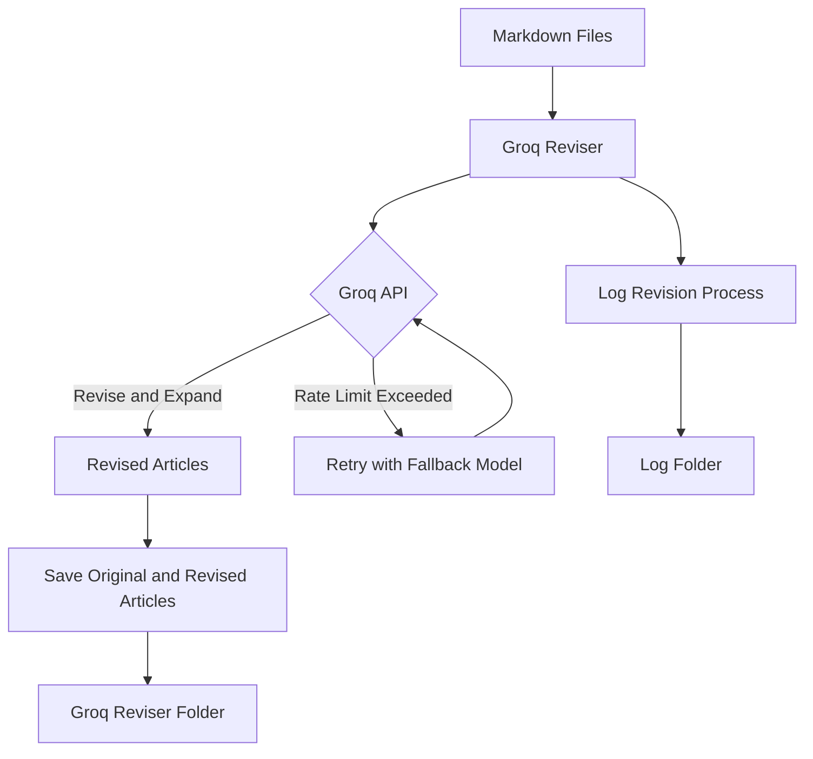

# Groq Reviser

Groq Reviser is a Python script that automates the process of revising and expanding articles using the Groq API and the powerful Llama 3 models. The choice of Groq and Llama 3 models for article revision is driven by their exceptional inference speed, as highlighted in this [tweet](https://x.com/sundeep/status/1795886302153580567) by Sundeep Nayak. The Llama 3 models provide a perfect balance between quality and efficiency, enabling quick and accurate revisions of articles.

The script takes Markdown files containing articles from a specified folder, sends them to the Groq API for revision and expansion using the Llama 3 models, and saves the revised articles along with the original articles in a new Markdown file. By leveraging the capabilities of Groq and Llama 3 models, Groq Reviser ensures high-quality article revisions while maintaining optimal performance.

The script provides a foundation for building a more comprehensive article generation pipeline. It can be easily expanded to include an orchestrator model that performs research using sources like DuckDuckGo, sends the research results to a writer model for initial article generation, and then passes the generated article to the reviser model for further refinement and expansion. While the current version of Groq Reviser focuses on the revision and expansion step, it serves as a starting point for implementing a complete end-to-end article generation solution.

For my personal use case, I utilize the following models from Gemini and Anthropic APIs:
- Gemini:
  - `gemini-1.5-pro-latest` for various tasks
  - `gemini-1.5-flash-latest` for research tasks and article outlining
- Anthropic:
  - `claude-3-opus-20240229` for article generation and revision

Note: The mentioned implementation using Anthropic and Gemini API for the orchestrator model is not currently open source and is not included in this repository.

## Features

- Automatically revises and expands articles using the Groq API
- Supports multiple Groq API keys for rate limit handling
- Retries requests with exponential backoff when rate limits are exceeded
- Switches to a fallback model when the primary model's rate limit is reached
- Logs the revision process for each article separately
- Saves the original and revised articles in a structured Markdown format
- Provides informative console output using Rich library

## Prerequisites

Before running the Groq Reviser script, ensure that you have the following:

- Python 3.x installed on your system
- Required Python packages listed in the `requirements.txt` file
- Groq API keys obtained from the Groq console
- Markdown files containing articles to be revised placed in the `groq-article` folder

## Installation

1. Clone the repository:

```bash
git clone https://github.com/llegomark/groq-reviser.git
```

2. Navigate to the project directory:

```bash
cd groq-reviser
```

3. Install the required Python packages:

```bash
pip install -r requirements.txt
```

4. Create a `config-groq.json` file in the project directory with the following structure:

```json
{
  "groq_api_key_1": "your-groq-api-key-1",
  "groq_api_key_2": "your-groq-api-key-2",
  "groq_api_key_3": "your-groq-api-key-3",
  "reviser_model": "your-reviser-model",
  "writer_model": "your-writer-model",
  "reviser_system_prompt": "your-reviser-system-prompt"
}
```

Replace the placeholders with your actual Groq API keys, model names, and system prompt.

## Usage

1. Place the Markdown files containing articles to be revised in the `groq-article` folder.

2. Run the Groq Reviser script:

```bash
python groq_reviser.py
```

3. The script will process each Markdown file in the `groq-article` folder, send the articles to the Groq API for revision and expansion, and save the revised articles along with the original articles in the `groq-reviser` folder.

4. Monitor the console output for progress updates, success messages, and any errors that may occur during the revision process.

5. Check the `log-groq` folder for detailed logs of each article's revision process.

## How It Works

Here's a diagram illustrating how the Groq Reviser works:



1. The Groq Reviser script reads Markdown files containing articles from the `groq-article` folder.
2. It sends each article to the Groq API for revision and expansion using the specified reviser model.
3. If the rate limit is exceeded for the primary model, the script retries the request with a fallback model.
4. The Groq API revises and expands the articles and returns the revised versions.
5. The script saves the original and revised articles in a structured Markdown format in the `groq-reviser` folder.
6. The revision process for each article is logged separately in the `log-groq` folder.

## Configuration

The `config-groq.json` file contains the following configuration options:

- `groq_api_key_1`, `groq_api_key_2`, `groq_api_key_3`: Groq API keys for authentication and rate limit handling.
- `reviser_model`: The primary model to be used for revising and expanding articles.
- `writer_model`: The fallback model to be used when the primary model's rate limit is exceeded.
- `reviser_system_prompt`: The system prompt to be used for the reviser model.

Make sure to update the configuration file with your own Groq API keys, model names, and system prompt.

## Dependencies

The Groq Reviser script relies on the following Python packages:

- `groq`: The official Python library for interacting with the Groq API.
- `rich`: A library for rich text and beautiful formatting in the terminal.
- `tenacity`: A library for adding retry functionality to API requests.

These dependencies are listed in the `requirements.txt` file and can be installed using `pip`.

## Contributing

Contributions to the Groq Reviser project are welcome! If you find any issues or have suggestions for improvements, please open an issue or submit a pull request on the GitHub repository.

## License

This project is licensed under the [MIT License](LICENSE).